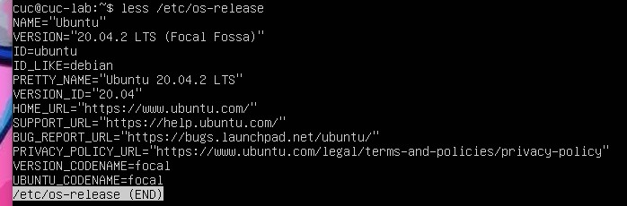
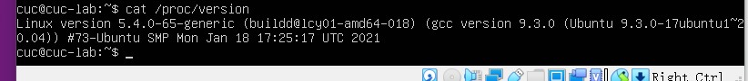
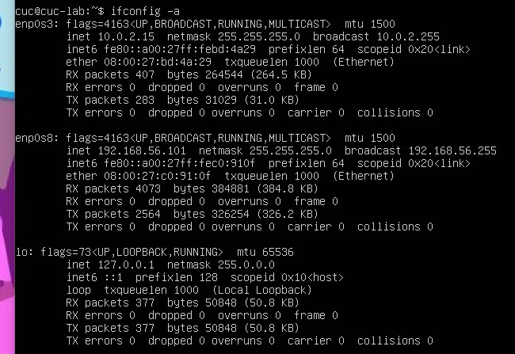
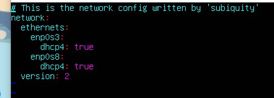
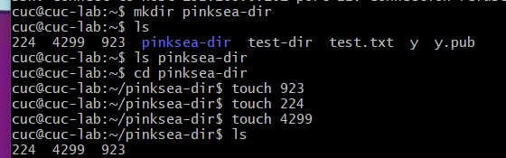
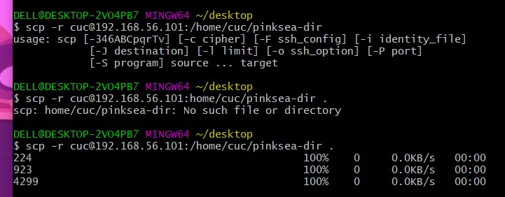
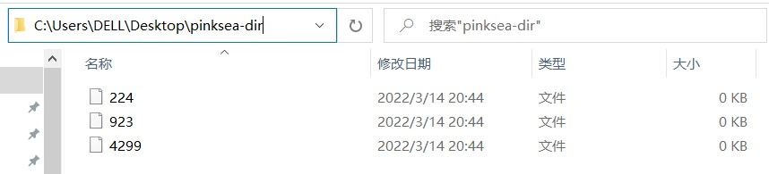
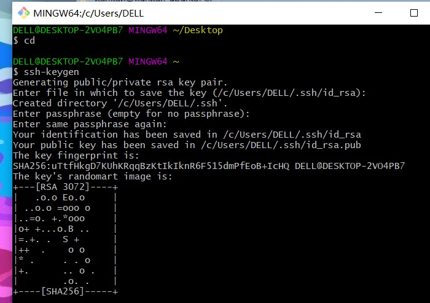

# 作业1

## 2020212063050沈禾妍

- #### 调查并记录实验环境的如下信息：

  ##### **当前Linux发行版基本信息**

  cat简易版
  
  

  cat详细版

  

  less详细版

  

  > P.S.
  >
  > ctrl+c退出命令执行，less中Q退出命令执行
  >
  > *通配符 查询目录下包含release的文件前缀与后缀

  **当前Linux内核版本信息**

  
  
- #### Virtualbox安装完Ubuntu之后新添加的网卡如何实现系统开机自动启用和自动获取IP？

  查询所有网卡

  

  查看网卡是否已实现系统开机自动启用和自动获取IP

  

- #### 如何使用scp在「虚拟机和宿主之间」、「本机和远程Linux系统之间」传输文件？

  ```cmd
  DELL@DESKTOP-2VO4PB7 MINGW64 ~
  $ pwd pinksea-dir//查询文件所在路径
  /c/Users/DELL
  
  cuc@cuc-lab:~$ mkdir pinksea-dir
  cuc@cuc-lab:~$ ls
  224  4299  923  pinksea-dir  test-dir  test.txt  y  y.pub
  cuc@cuc-lab:~$ cd pinksea-dir//切换路径，进入文件
  cuc@cuc-lab:~/pinksea-dir$ touch 923//创立新文件
  cuc@cuc-lab:~/pinksea-dir$ touch 224
  cuc@cuc-lab:~/pinksea-dir$ touch 4299
  cuc@cuc-lab:~/pinksea-dir$ ls //查询文件是否创立成功
  224  4299  923
  
  cuc@cuc-lab:~$ pwd pinksea-dir
  /home/cuc//查询文件路径
  ```

  

  ```cmd
  DELL@DESKTOP-2VO4PB7 MINGW64 ~/desktop
  $ scp -r cuc@192.168.56.101:/home/cuc/pinksea-dir
  ```

  将查询得到的路径输入，成功传输文件！

  

  

  

  

  自证清白：远程目录下还没有desktop.ini

  

  传输成功

  

  

  

- #### 如何配置SSH免密登录？

  首先创建密钥

  
  
  将公钥加入远程主机
  
  


### 问题与解决：

- 传输文件时由于已经做好ssh免密登录，习惯性登录了，导致最终传输文件时是在由Linux传输到Linux，持续性报错

  重新Gitbash并停留在desktop路径，文件实现从Linux到桌面。

- 配置新网卡时，发现已有参数dhcp4: ture

  听课后发现20.04版本会自动配好ip，直接开启dhch地址分配。

- 代码块不太清楚gitbash对应哪种语言

  查询后发现是bash基于CMD的,在CMD的基础上增添一些新的命令与功能。


### 参考资料：

- https://blog.csdn.net/xiongyangg/article/details/110206220、

  关于添加新网卡后设置自动启用并获取ip

- https://blog.csdn.net/seek_of/article/details/79180377

  关于本地windows机器和远程Linux服务器之间文件传输 

- https://blog.csdn.net/qq_38409944/article/details/80257408

  关于bash与cmd的区别