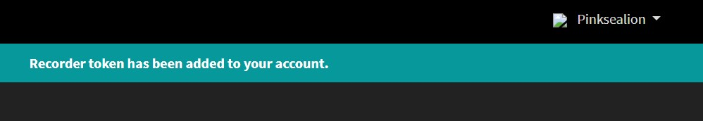
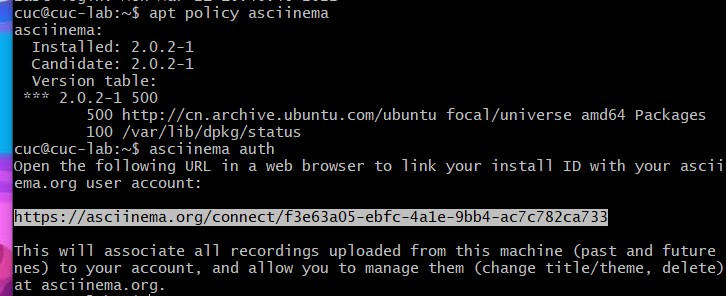
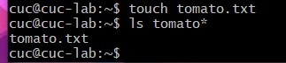

# 作业1

## 软件环境

- 当前课程推荐的 Linux 发行版本
  - 本地环境（Ubuntu）
  - 云环境（CentOS）
  
- 在[asciinema](https://asciinema.org/)注册一个账号，并在本地安装配置好asciinema

  

- 确保本地已经完成**asciinema auth**，并在[asciinema](https://asciinema.org/)成功关联了本地账号和在线账号

  

  **installation（Ubuntu）**

  ```
  sudo apt-add-repository ppa:zanchey/asciinema
  sudo apt-get update
  sudo apt-get install asciinema
  ```

  To start recording run the following command in your terminal:

  ```
  $ asciinema rec
  ```

  **instruction**

  When you're ready to finish just exit the shell, either by typing `exit` or hitting C-d.

- 在自己的github仓库上新建markdown格式纯文本文件附上asciinema的分享URL

- **提醒** 避免在终端操作录像过程中暴漏**密码、个人隐私**等任何机密数据

  

## 实验问题
使用表格方式记录至少 2 个不同 Linux 发行版本上以下信息的获取方法，使用 asciinema 录屏方式「分段」记录相关信息的获取过程和结果

### 结果表格

|       Linux发行版本       |                         Ubuntu 20.04                         |                          CentOS 7.7                          |
| :-----------------------: | :----------------------------------------------------------: | :----------------------------------------------------------: |
|      **安装软件包**       |                        `apt install`                         |                       `yum install -y`                       |
|      **更新软件包**       |                        `apt upgrade`                         |                         `yum update`                         |
|      **卸载软件包**       |               `apt-get remove`/`apt-get purge`               |                         `yum remove`                         |
|  **查看软件包安装路径**   |                          `apt show`                          |                         `yum search`                         |
|      **查看文件名**       |             `sudo find ./ -type f -name "*&&&*"`             |                   `find ./ -name '*&&&*'`                    |
|     **查看文件内容**      |          `sudo grep -r "***" ./ --exclude = *.cast`          |           `sudo grep -r '666' ./ --exclude=*.cast`           |
|   **文件解压缩**`gzip`    |                 `gzip 文件`\ `gzip -dv 文件`                 |                 `gzip 文件`\ `gzip -dv 文件`                 |
|   **文件解压缩**`bzip2`   |                `bzip2 文件`\ `bzip2 -d 文件`                 |                `bzip2 文件`\ `bzip2 -d 文件`                 |
|    **文件解压缩**`zip`    |           `zip -r 文件.zip 文件`\ `unzip 文件.zip`           |           `zip -r 文件.zip 文件`\ `unzip 文件.zip`           |
|    **文件解压缩**`tar`    | `tar -czvf test1.tar.gz b.h (压缩 b.h文件为test1.tar.gz)`\ `tar -xzvf test1.tar.gz` | `tar -czvf test1.tar.gz b.h (压缩 b.h文件为test1.tar.gz)`\ `tar -xzvf test1.tar.gz` |
| **文件解压缩**`7z(p7zip)` |                 `p7zip 文件`\ `7z x 文件.7z`                 |                 `p7zip 文件`\ `7z x 文件.7z`                 |
|    **文件解压缩**`rar`    |          `rar a 文件.rar 文件`\ `unrar e 文件.rar`           |          `rar a 文件.rar 文件`\ `unrar e 文件.rar`           |
|  **硬件信息获取（CPU）**  |               `grep "model name" /proc/cpuinfo               |  awk -F ':' '{print $NF}'(查看CPU型号)`,`cat /proc/cpuinfo   |
| **硬件信息获取（内存）**  |                      `cat /proc/meminfo                      |                        grep MemTotal`                        |
| **硬件信息获取（硬盘）**  |                        `sudo fdisk -l                        |                          grep Disk`                          |

### Ubuntu20.04


- ##### 【软件包管理】

  在目标发行版上安装` tmux` 和` tshark` ；

  ```
  sudo apt install tmux;
  sudo apt install tmux
  ```

  [](https://asciinema.org/a/WS7RafsblCAoBr8hzGHygJXip)

  查看这 2 个软件被安装到哪些路径；

  ```
  sudo apt-cache show tmux;
  sudo apt-cache show tshark
  ```

  [](https://asciinema.org/a/tJ03KPMgvEUX1Rb4OWGjw0jw8)

  卸载` tshark` ；

  ```
  sudo apt-get purge tshark
  ```

  [](https://asciinema.org/a/A3ElBgTPbQsq4eaYCCKjoTvZ0)

  验证` tshark` 卸载结果
  ```
  sudo apt-cache show tshark
  ```
  
  [](https://asciinema.org/a/iR396Hl1EKeTNicxt9lzunfd3)

- ##### 【文件管理】

  复制以下`shell`代码到终端运行，在目标 Linux 发行版系统中构造测试数据集，然后回答以下问题：
  ```cmd
  cd /tmp && for i in $(seq 0 1024);do dir="test-$RANDOM";mkdir "$dir";echo "$RANDOM" > "$dir/$dir-$RANDOM";done
  ```

  
  - 找到 `/tmp` 目录及其所有子目录下，**文件名**包含 `666` 的所有文件
  
    ```
    sudo find ./ -type f -name "*666*"
    ```
  
    [](https://asciinema.org/a/6cJEBllNCAeYnf5Z1pTHdEUyY)
  
  - 找到 `/tmp` 目录及其所有子目录下，**文件内容**包含 `666` 的所有文件
  
    ```
    sudo grep -r "666"
    ```
  
    [](https://asciinema.org/a/w0xv5hsAioBu0Izl9Yk5Hn6it)


- ##### 【文件压缩与解压缩】

  练习课件中 [文件压缩与解压缩](https://c4pr1c3.github.io/LinuxSysAdmin/chap0x02.md.html#/12/1) 一节所有提到的压缩与解压缩命令的使用方法

  - 在虚拟机内创建文件`tomato.txt`

  
  - gzip

    压缩
    ```
    gzip [file]
    ```

    解压
    ```
    gzip -dv [file]
    ```

    [](https://asciinema.org/a/LJnOLfOfWX21eg2l9ejZqN7qo)

  - bzip2

    压缩
    ```
    bzip2 [file]
    ```

    解压
    ```
    bzip2 -d [file]
    ```

    [](https://asciinema.org/a/RPbEJ5sG9wxnHwLZ4hytLaRxm)

  - zip

    压缩
    ```
    zip -r [file].zip [file]
    ```

    解压
    ```
    unzip [file].zip
    ```

    [](https://asciinema.org/a/efTkSLFzhOOsP26JcxBMWSeLP)

  - tar

    压缩
    ```
    tar -czvf [filename].tar.gz [file]  (压缩文件为[文件名].tar.gz)
    ```

    解压
    ```
    tar -xzvf [filename].tar.gz
    ```

    [](https://asciinema.org/a/D74fDG5GmK4HWwWukW1lHGuNj)

  - 7z(p7zip)

    压缩
    ```
    p7zip [file]
    ```

    解压
    ```
    7z x [file].7z
    ```

    [](https://asciinema.org/a/5Mcv1DUzAtYIjCYiAimrWEqbC)

  - rar (p7zip-rar / unrar-free)

    压缩

    ```
    rar a [filename].rar [file]
    ```
    解压

    ```
    rar x [filename].rar 
    unrar e [filename].rar
    ```
    
    [](https://asciinema.org/a/F2djFF94FuHZhvFOfJDCEPavJ)

- ##### 【跟练】 [子进程管理实验](https://asciinema.org/a/f3ux5ogwbxwo2q0wxxd0hmn54)

  [](https://asciinema.org/a/TbkWOvo4gLqGEDKRvp8z2He8W)

- ##### 【硬件信息获取】

  目标系统的 CPU、内存大小、硬盘数量与硬盘容量

  CPU

  ```
  grep "model name" /proc/cpuinfo |awk -F ':' '{print $NF}'
  \\型号
  cat /proc/cpuinfo | grep "physical id" | uniq | wc -l
  \\个数
  cat /proc/cpuinfo | grep "cpu cores" | uniq 
  \\核数
  ```

  内存

  ```
  cat /proc/meminfo | grep MemTotal
  ```

  硬盘

  ```
  sudo fdisk -l | grep Disk 
  ```
  
  [](https://asciinema.org/a/CFHAsS8NBCcsS8qMgE8D1kvNR)

### CentOS


- ##### 【软件包管理】

  在目标发行版上安装` tmux` 和` tshark` ；

  ```
  yum install tmux
  yum install wireshark
  ```

  [](https://asciinema.org/a/w5Xz7uT7J8WAlV29ND6yMC8Ti)

  查看这 2 个软件被安装到哪些路径；

  ```
  rpm -qal | grep tmux;
  rpm -qal | grep tshark
  ```

  [](https://asciinema.org/a/IW8Ty8lnCMJ6awJzZ21wwMAkk)

  卸载` tshark` ；

  ```
  yum -y remove wireshark
  ```

  [](https://asciinema.org/a/Kn4JLh67OoCcyraNqpMoo1XGi)

  验证` tshark` 卸载结果
  ```
  rpm -qal | grep tshark
  ```
  
  [](https://asciinema.org/a/APLVT8WyIuFhKX6pOdlFCNsDA)

- ##### 【文件管理】

  复制以下`shell`代码到终端运行，在目标 Linux 发行版系统中构造测试数据集，然后回答以下问题：
  ```cmd
  cd /tmp && for i in $(seq 0 1024);do dir="test-$RANDOM";mkdir "$dir";echo "$RANDOM" > "$dir/$dir-$RANDOM";done
  ```

  
  - 找到 `/tmp` 目录及其所有子目录下，**文件名**包含 `666` 的所有文件
  
    ```
    sudo find ./ -type f -name "*666*"
    ```
  
    [](https://asciinema.org/a/Z5CMgBRddrxMmB7WKoSMDUDHx)
  
  - 找到 `/tmp` 目录及其所有子目录下，**文件内容**包含 `666` 的所有文件
  
    ```
    sudo grep -r "666"
    ```
  
       [](https://asciinema.org/a/ahmPdfONHD84r8CE85UmBv1dc)

- ##### 【硬件信息获取】目标系统的 CPU、内存大小、硬盘数量与硬盘容量

  - CPU
  
  ```
  cat /proc/cpuinfo | grep 'model name' |uniq 
  \\型号
  cat /proc/cpuinfo | grep "physical id" | uniq | wc -l
  \\个数
  cat /proc/cpuinfo | grep "cpu cores" | uniq 
  \\核数
  ```
  
  - 内存
  
  ```
  cat /proc/meminfo | grep MemTotal
  ```
  
  - 硬盘
  
  ```
  df -hl 
  \\剩余空间
  df -h 
  \\文件系统信息
  ```
  [](https://asciinema.org/a/5Z0n2QTvH48DkvTtWHw8aUQ77)


## 问题与解决：

- 操作软件包管理安装 `tmux` 时，asciinema录屏操作失败，想要将其卸载后重新安装，但remove后仍不断显示存在此文件。

  查找得卸载代码：
  ```
  sudo apt-get remove tshark (删除软件包而保留软件的配置文件)
  sudo apt-get purge tshark (同时清除软件包和软件的配置文件)
  ```

  选用purge后成功卸载。

- 本想采用资料中查找到的先在本地创建文件再传输至虚拟机，scp了半天惊觉可以直接在虚拟机内创立文件

  进入虚拟机touch文件，成功。


## 参考资料：

- https://blog.csdn.net/suiyueruge1314/article/details/102628302

  关于tmux卸载

- https://asciinema.org/docs/installation

  asciinema相关

- https://blog.csdn.net/weixin_34354945/article/details/89912482

  ls查找复习
  
- https://asciinema.org/a/f3ux5ogwbxwo2q0wxxd0hmn54

  跟练（第四题）
  
- https://mbd.baidu.com/ug_share/mbox/4a81af9963/share?tk=67b832ba50ddcb1185c8d1ee589f4a99&share_url=https%3A%2F%2Fyebd1h.smartapps.cn%2Fpages%2Fblog%2Findex%3FblogId%3D103170541%26_swebfr%3D1%26_swebFromHost%3Dbaiduboxapp

  asciinema在CentOS环境安装
  
  
  
  