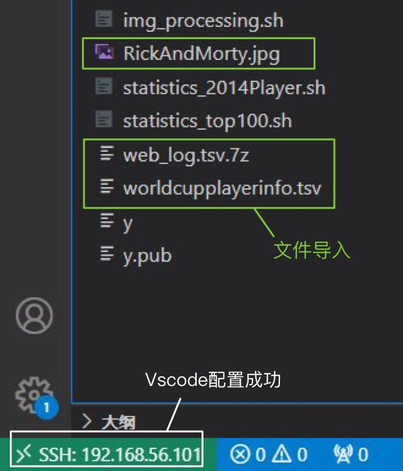
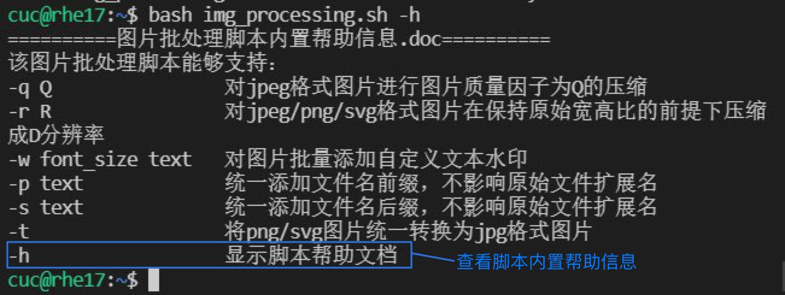
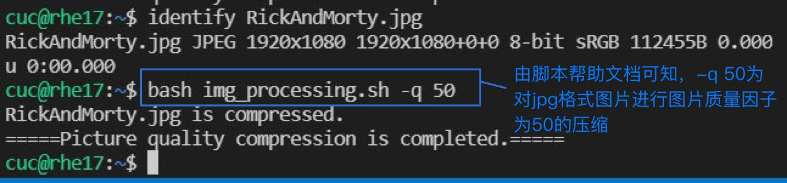
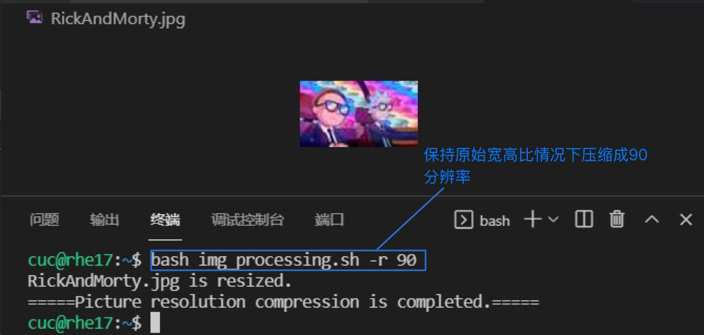
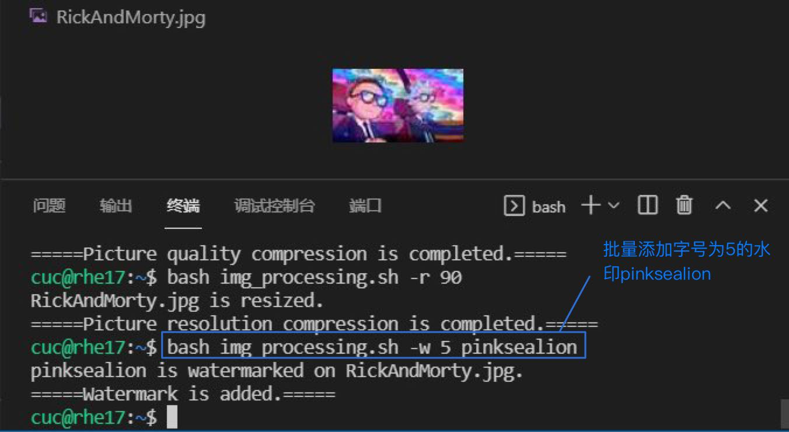
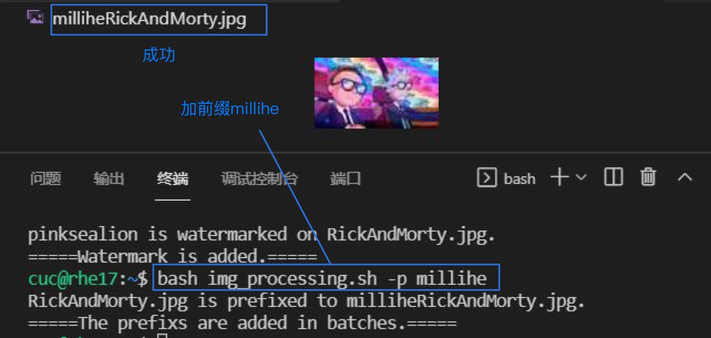
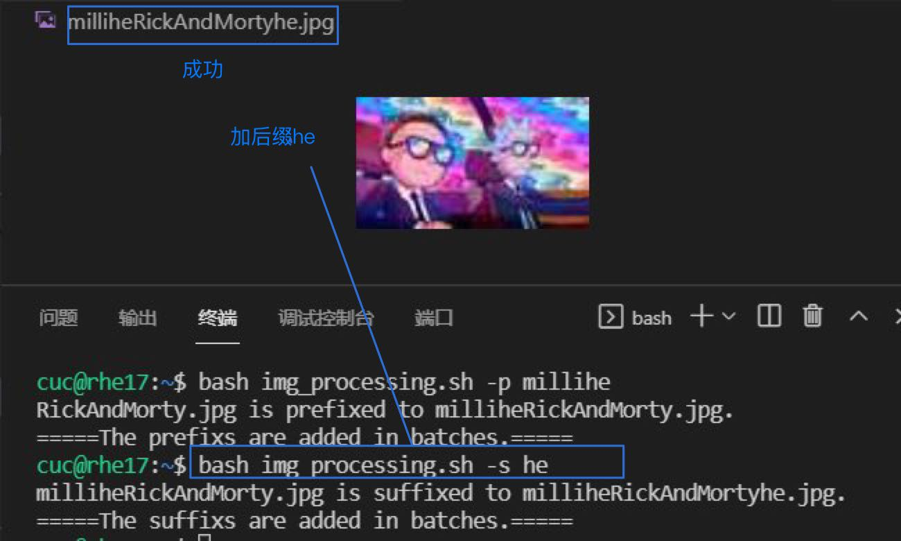
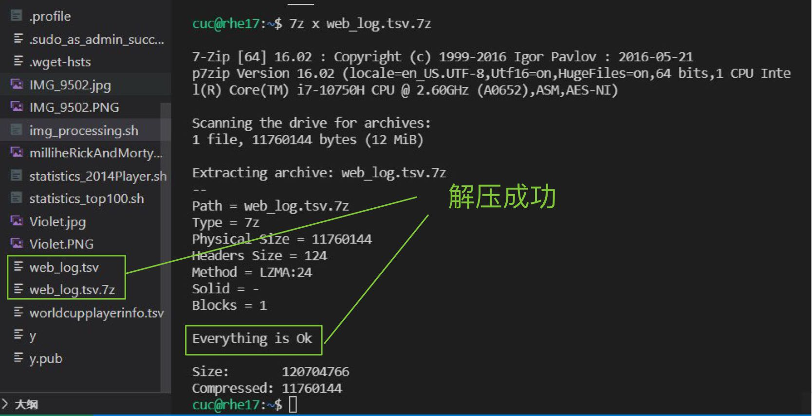
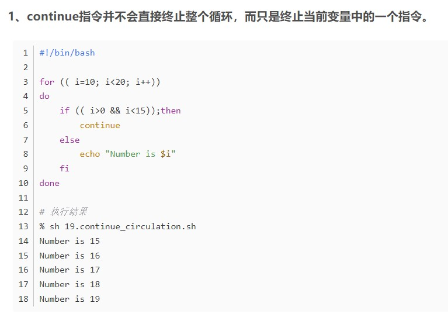
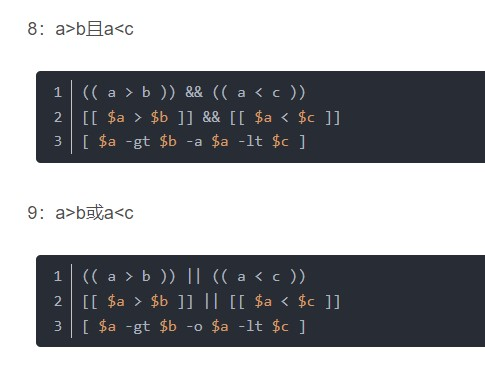

# 实验4

## 软件环境

- Ubuntu 20.04
- VirtualBox 6.1.16
- Visual Studio Code 1.58.1

## 实验报告要求

- 继承[第一章：Linux基础（实验）](https://c4pr1c3.github.io/LinuxSysAdmin/chap0x01.exp.md.html)的所有实验报告要求

  > 使用 `markdown` 格式纯文本
  >
  > 使用 [Github Classroom](https://classroom.github.com/classrooms) 管理作业（课堂当日宣讲为准）
  >
  > 每次作业应 `commit` 到独立分支并通过 `Pull Request` 分别提交每一次作业
  >
  > 实验报告应图文并茂的记录实验过程，证明自己独立完成的实验作业
  >
  > 记录自己独立解决的问题和解决办法，并给出问题解决用到的参考资料出处、链接

- 任务的所有源代码文件必须单独提交并提供详细的**–help**脚本内置帮助信息

- 任务二的所有统计数据结果要求写入独立实验报告

## 实验问题

#### 任务一：用bash编写一个图片批处理脚本，实现以下功能：

- 支持命令行参数方式使用不同功能
- 支持对指定目录下所有支持格式的图片文件进行批处理
- 支持以下常见图片批处理功能的单独使用或组合使用
  - 支持对jpeg格式图片进行图片质量压缩
  - 支持对jpeg/png/svg格式图片在保持原始宽高比的前提下压缩分辨率
  - 支持对图片批量添加自定义文本水印
  - 支持批量重命名（统一添加文件名前缀或后缀，不影响原始文件扩展名）
  - 支持将png/svg图片统一转换为jpg格式图片

#### 任务二：用bash编写一个文本批处理脚本，对以下附件分别进行批量处理完成相应的数据统计任务：

- ##### 2014世界杯运动员数据

  - 统计不同年龄区间范围（20岁以下、[20-30]、30岁以上）的球员**数量**、**百分比**
  - 统计不同场上位置的球员**数量**、**百分比**
  - 名字最长的球员是谁？名字最短的球员是谁？
  - 年龄最大的球员是谁？年龄最小的球员是谁？

- ##### Web服务器访问日志

  - 统计访问来源主机TOP 100和分别对应出现的总次数
  - 统计访问来源主机TOP 100 IP和分别对应出现的总次数
  - 统计最频繁被访问的URL TOP 100
  - 统计不同响应状态码的出现次数和对应百分比
  - 分别统计不同4XX状态码对应的TOP 10 URL和对应出现的总次数
  - 给定URL输出TOP 100访问来源主机

## 实验步骤

配置好vscode，并将所需文件如待处理图片等导入。



### 任务一

```bash
# shellcheck安装

$ sudo apt-get install -y epel-release
$ sudo apt-get install -y shellcheck
$ sudo apt-get install -y imagemagick

# 查看–h脚本内置帮助信息

$ shellcheck imagebatch.sh
$ bash imagebatch.sh -h
```



```bash
# 支持对jpg格式图片进行图片质量压缩

$ identify RickAndMorty.jpg
$ bash img_processing.sh -q 50
```



```bash
# 支持对jpg/png/svg格式图片在保持原始宽高比的前提下压缩分辨率

$ bash img_processing.sh -r 90
```



```bash
# 支持对图片批量添加自定义文本水印

$ bash img_processing.sh -w 5 pinksealion
```



```bash
# 支持批量重命名（统一添加文件名前缀或后缀，不影响原始文件扩展名）

$ bash img_processing.sh -p millihe
```



```bash
# 支持批量重命名（统一添加文件名前缀或后缀，不影响原始文件扩展名）

$ bash img_processing.sh -s he
```



```bash
# 支持将png/svg图片统一转换为jpg格式图片

$ identify Violet.PNG
$ bash img_processing.sh -t
```

### 任务二

2014世界杯运动员数据

```bash
# 查看–h脚本内置帮助信息
$ shellcheck statistics_2014Player.sh
$ bash statistics_2014Player.sh -h

# 统计不同年龄区间范围（20岁以下、[20-30]、30岁以上）的球员数量、百分比
$ bash statistics_2014Player.sh -a

# 统计不同场上位置的球员数量、百分比
$ bash statistics_2014Player.sh -p

# 查询名字最长的球员
$ bash statistics_2014Player.sh -l

# 查询名字最短的球员
$ bash statistics_2014Player.sh -s

# 查询年龄最大的球员
$ bash statistics_2014Player.sh -o

# 查询年龄最小的球员
$ bash statistics_2014Player.sh -y
```

Web服务器访问日志

```bash
# 解压文件
$ 7z x web_log.tsv.7z 
```



```bash
# 查看–h脚本内置帮助信息
$ shellcheck statistics_top100.sh
$ bash statistics_top100.sh -h

# 统计访问来源主机TOP 100和分别对应出现的总次数
$ bash statistics_top100.sh -t

# 统计访问来源主机TOP 100 IP和分别对应出现的总次数
$ bash statistics_top100.sh -i

# 统计最频繁被访问的URL TOP 100
$ bash statistics_top100.sh -u

# 统计不同响应状态码的出现次数和对应百分比
$ bash statistics_top100.sh -c

# 分别统计不同4XX状态码对应的TOP 10 URL和对应出现的总次数
$ bash statistics_top100.sh -f

# 给定URL输出TOP 100访问来源主机
$ bash statistics_top100.sh -s /software/winvn/winvn.html/bluemarb.gif
```

结果见独立实验报告。

## 问题与解决：

- 执行到`bash img_processing.sh -t`，即转换文件格式时，显示成功转换但在目录下找不到转换后的jpg文件，更改脚本无果，直接convert了一下。

  更新：重新启动了一遍以后正常运行了......

- 转换文件的此段代码：

  ```sh
  # 将png/svg图片统一转换为jpg格式图片
  # convert xxx.png xxx.jpg
  function Trans_into_jpg(){
      for i in *;do
          type=${i##*.} # 获取文件类型 （删除最后一个.及左边的全部字符）
          if [[ ${type} != "png" && ${type} != "svg" ]]; then continue; fi;
          new_file=${i%.*}".jpg"
          convert "${i}" "${new_file}"
          echo "${i} is transformed into ${new_file}."
      done
  
      echo "=====Format conversion is completed.====="
  }
  ```

  一开始完全不能理解，问题有二：
  
  1. if条件判断与结束感觉与之后的代码关系不大？仅仅是进行了对类型的判断，并未跳出循环，也就是说文件就算并非png或svg，仍是会进行if后的操作的（错误认知！）
  2. 为什么需要[]内嵌[]?
  
  后仔细研读了一下**if语句**等，发现：
  
  首先问题一，此处应该是判断了如果不是png或svg，则continue继续循环，直到遇到文件类型为二者之一的才跳出if，执行变换为jpg。
  
  如图所示：
  
  
  
  其次问题二，双方括号[[ ]]：表示高级字符串处理函数
  双方括号中判断命令使用标准的字符串比较，还可以使用匹配模式，从而定义与字符串相匹配的正则表达式。
  
  

## 参考资料：

- [Lychee00](https://github.com/CUCCS/2021-linux-public-Lychee00/tree/59f2315af612524250237beb3769434244a9cddd/chap0x04)
- [PNG转换为JPG](https://qastack.cn/superuser/71028/batch-converting-png-to-jpg-in-linux)
- [Typora的一些使用](https://www.csdn.net/tags/Ntjakg4sNDcwMzMtYmxvZwO0O0OO0O0O.html)
- [bash脚本编写](https://www.sohu.com/a/403820540_495675)
- [shellcheck安装](https://www.csdn.net/tags/MtjaYgysMDU5MjgtYmxvZwO0O0OO0O0O.html)
- [bash里的if语句](https://blog.csdn.net/s2421458535/article/details/101022029)
- [shell中的if语句](https://blog.csdn.net/wxx_0124/article/details/95305625)
- [shell中的continue语句](https://blog.csdn.net/qq_37189082/article/details/121846754)
- [vscode直接生成表格](https://www.csdn.net/tags/OtTaUgysNDAxNy1ibG9n.html)
