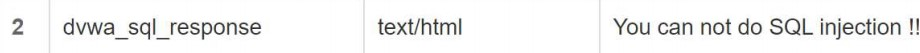

# 实验5

## 实验环境

- **VirtualBox 6.1.16**
- **Ubuntu 20.04**
- **Visual Studio Code**
- **[Nginx](http://nginx.org/)**
- **[VeryNginx](https://github.com/alexazhou/VeryNginx)**
- **[WordCompress 4.7](https://wordpress.org/)**

## 实验问题

**基本要求：**

- 在一台主机（虚拟机）上同时配置[Nginx](http://nginx.org/)和[VeryNginx](https://github.com/alexazhou/VeryNginx)

  - VeryNginx作为本次实验的Web App的反向代理服务器和WAF

  - PHP-FPM进程的反向代理配置在nginx服务器上，VeryNginx服务器不直接配置Web站点服务

- 使用[Wordpress](https://wordpress.org/)搭建的站点对外提供访问的地址为： http://wp.sec.cuc.edu.cn

- 使用[Damn Vulnerable Web Application (DVWA)](http://www.dvwa.co.uk/)搭建的站点对外提供访问的地址为： http://dvwa.sec.cuc.edu.cn

**安全加固要求：**

- 使用IP地址方式均无法访问上述任意站点，并向访客展示自定义的友好错误提示信息页面-1
- [Damn Vulnerable Web Application(DVWA)](https://dvwa.co.uk/)只允许白名单上的访客来源IP，其他来源的IP访问均向访客展示自定义的友好错误提示信息页面-2
- 在不升级Wordpress版本的情况下，通过定制[VeryNginx](https://github.com/alexazhou/VeryNginx)的访问控制策略规则，**热**修复[WordPress < 4.7.1 - Username Enumeration](https://www.exploit-db.com/exploits/41497/)
- 通过配置[VeryNginx](https://github.com/alexazhou/VeryNginx)的Filter规则实现对[Damn Vulnerable Web Application(DVWA)](https://dvwa.co.uk/)的SQL注入实验在低安全等级条件下进行防护

**VeryNginx配置要求：**

- [VeryNginx](https://github.com/alexazhou/VeryNginx)的Web管理页面仅允许白名单上的访客来源IP，其他来源的IP访问均向访客展示自定义的**友好错误提示信息页面-3**
- 通过定制[VeryNginx](https://github.com/alexazhou/VeryNginx)的访问控制策略规则实现：
  - 限制DVWA站点的单IP访问速率为每秒请求数 < 50
  - 限制Wordpress站点的单IP访问速率为每秒请求数 < 20
  - 超过访问频率限制的请求直接返回自定义错误提示信息页面-4
  - 禁止curl访问

## 实验内容

### 一、环境搭建

**修改主机host文件**

```
# nginx
192.168.56.101 vn.sec.cuc.edu.cn
192.168.56.101 dvwa.sec.cuc.edu.cn
192.168.56.101 wp.sec.cuc.edu.cn
```

**配置php及相关组件**

```bash
$ sudo apt install php-fpm php-mysql php-curl php-gd php-intl php-mbstring php-soap php-xml php-xmlrpc php-zip
```

**VeryNginx**

- 克隆VeryNginx仓库

  ```bash
  $ git clone https://github.com/alexazhou/VeryNginx.git
  ```

- 安装python3与之前对缺失的库补充安装

  ```bash
  # zlib
  $ sudo apt-get install zlib1g-dev
  
  # pcre
  $ sudo apt-get update 
  $ sudo apt-get install libpcre3 libpcre3-dev
  
  # gcc 
  $ sudo apt install gcc
  
  # make
  $ sudo apt install make
  
  # penssl library
  $ sudo apt install libssl-dev
  
  # python3
  $ cd VeryNginx
  $ sudo python3 install.py install
  ```

  

- 配置

  ```bash
  # 修改 `/opt/verynginx/openresty/nginx/conf/nginx.conf` 配置文件
  $ sudo vim /opt/verynginx/openresty/nginx/conf/nginx.conf
  
  # 将user用户名从nginx修改为www-data
  user  www-data;
  
  # 修改server监听端口为8081(不和其他端口冲突)
  server {
          listen 192.168.56.101:8081;
          
          #this line shoud be include in every server block
          include /opt/verynginx/verynginx/nginx_conf/in_server_block.conf;
  
          location = / {
              root   html;
              index  index.html index.htm;
          }
      }
  ```

- 添加进程权限

  ```bash
  $ chmod -R 777 /opt/verynginx/verynginx/configs
  ```

- 访问服务器的8081端口，安装成功

  

- 访问8081端口。使用默认的用户名和密码`verynginx`/`verynginx` 进入`verynginx/index.html`

- 登陆成功

  

**Nginx**

```bash
# 下载压缩包
$ wget http://nginx.org/download/nginx-1.20.1.tar.gz

# 解压
$ tar -zxvf nginx-1.20.1.tar.gz

# 安装
$ sudo apt-get install libpcre3-dev
$ sudo apt-get install openssl
$ cd nginx-1.20.1
$ ./configure
$ make && make install
$ cd /usr/local/nginx
$ cd sbin
$ ./nginx
```


**WordPress**

- 安装并建立数据库

  ```bash
  # 下载安装包
  $ sudo wget https://wordpress.org/wordpress-4.7.zip
  
  # 解压
  $ sudo apt install p7zip-full
  $ sudo 7z x wordpress-4.7.zip
  
  # 将解压后的wordpress移至指定路径
  $ sudo mkdir /var/www/html/wp.sec.cuc.edu.cn
  $ sudo cp -r wordpress /var/www/html/wp.sec.cuc.edu.cn
  
  # 登录数据库
  $ sudo mysql 
  
  # 新建数据库
  $ CREATE DATABASE wordpress DEFAULT CHARACTER SET utf8 COLLATE utf8_unicode_ci;
  
  # 新建用户 
  $ create user 'millihe'@'localhost' IDENTIFIED BY 'shy020217';
  # 授权
  $ grant all on wordpress.* to 'millihe'@'localhost';
  ```

- 配置

  ```bash
  # 重启php-fpm
  $ sudo systemctl restart php7.4-fpm
  
  # 进入nginx目录
  $ sudo vim /etc/nginx/sites-enabled/default
  
  # 将网站根站点修改为wordpress的安装目录 并保存退出
  root /var/www/html/wp.sec.cuc.edu.cn;
  
  # 将WordPress网站目录所属用户组设定至Nginx指定的用户（由/etc/nginx/nginx.conf配置中的user www-data;指定）
  $ sudo chown -R www-data /var/www/html/wp.sec.cuc.edu.cn;
  $ sudo chgrp -R www-data /var/www/html/wp.sec.cuc.edu.cn;
  ```

- 使用`wp.sec.cuc.edu.cn/wordpress/wp-admin/`访问wordpress进行配置，选择语言，然后连接数据库，设置完wordpress用户名密码即可访问wordpress网站。

  

- 配置PHP-FPM进程的反向代理

  - 配置Nginx服务器块文件

  ```BASH
  $ sudo vim /etc/nginx/sites-available/wp.sec.cuc.edu.cn
  ```

  - 写入：

  ```bash
  server {
    listen 80 default_server;
    listen [::]:80 default_server;
  
    root /var/www/html/wp.sec.cuc.edu.cn;
    index index.php index.html index.htm index.nginx-debian.html;
    server_name wp.sec.cuc.edu.cn;
  
    location / {
        # try_files $uri $uri/ =404;
        try_files $uri $uri/ /index.php$is_args$args;
  
    }
  
    # 配置PHP-FPM进程的反向代理配置在nginx服务器上    
    location ~ \.php$ {
        include snippets/fastcgi-php.conf;
        fastcgi_pass unix:/var/run/php/php7.4-fpm.sock;
    }
  
    location ~ /\.ht {
        deny all;
    }
  }
  ```

  - 创建从新服务器块配置文件到`/etc/nginx/sites-enabled/`目录的符号链接

  ```bash
  $ sudo ln -s /etc/nginx/sites-available/wp.sec.cuc.edu.cn /etc/nginx/sites-enabled/
  ```

  - 取消链接默认配置文件

  ```bash
  $ sudo unlink /etc/nginx/sites-enabled/default
  ```

  - 测试并重启nginx

  ```bash
  $ sudo nginx -t
  $ sudo systemctl reload nginx
  ```

**DVWA**

- 安装

```bash
# 下载
git clone https://github.com/digininja/DVWA.git
# 建立目录
sudo mkdir /var/www/html/dvwa.sec.cuc.edu.cn
# 移动文件夹内容至该目录下
sudo mv DVWA/* /var/www/html/dvwa.sec.cuc.edu.cn
```

- 配置MySQL

```bash
sudo mysql
CREATE DATABASE dvwa DEFAULT CHARACTER SET utf8 COLLATE utf8_unicode_ci;
CREATE USER 'dvwa'@'localhost' IDENTIFIED BY 'p@ssw0rd';
GRANT ALL ON dvwa.* TO 'dvwa'@'localhost';
exit
```

- 配置PHP

```bash
sudo mv config.inc.php.dist config.inc.php

# 默认配置：
$_DVWA[ 'db_database' ] = 'dvwa';
$_DVWA[ 'db_user' ] = 'dvwa';
$_DVWA[ 'db_password' ] = 'p@ssw0rd';

# 修改php-fpm文件
sudo vim /etc/php/7.4/fpm/php.ini 

display_errors: Off
safe_mode: Off
allow_url_include: On
allow_url_fopen: On

#重启php
systemctl restart php7.4-fpm.service

#授权给www-data用户和组
sudo chown -R www-data.www-data /var/www/html/dvwa.sec.cuc.edu.cn
```

- 配置服务器块文件

```bash
sudo vim /etc/nginx/sites-available/dvwa.sec.cuc.edu.cn

# 写入配置文件
server {
    listen 8080 default_server;
    listen [::]:8080 default_server;

    root /var/www/html/dvwa.sec.cuc.edu.cn;
    index index.php index.html index.htm index.nginx-debian.html;
    server_name dvwa.sec.cuc.edu.cn;

    location / {
        #try_files $uri $uri/ =404;
        try_files $uri $uri/ /index.php$is_args$args;  
    }

    location ~ \.php$ {
        include snippets/fastcgi-php.conf;
        fastcgi_pass unix:/var/run/php/php7.4-fpm.sock;
    }

    location ~ /\.ht {
        deny all;
    }
}

# 创建软链接
sudo ln -s /etc/nginx/sites-available/dvwa.sec.cuc.edu.cn /etc/nginx/sites-enabled/

# 检查并重启服务
sudo nginx -t
systemctl restart nginx.service
```

- 成功访问

  

### 二、实验过程

**VeryNginx反向代理WordPress&DVWA**

- Matcher配置`wp.sec.cuc.edu.cn`和`dvwa.sec.cuc.edu.cn`

  

- Up Stream&Proxy Pass添加Up Stream节点以及添加代理通行证

  

**安全加固要求**

- 使用IP地址方式均无法访问上述任意站点，并向访客展示自定义的友好错误提示信息页面-1

  - Matcher

    

  - Response

    

  - Filter

    

  - Result

    

- DVWA只允许白名单上的访客来源IP，其他来源的IP访问均向访客展示自定义的友好错误提示信息页面-2

  - Matcher

    

  - Response

    

  - Filter

    

  - Result

    

- 在不升级Wordpress版本的情况下，通过定制VeryNginx的访问控制策略规则，**热**修复[WordPress < 4.7.1 - Username Enumeration](https://www.exploit-db.com/exploits/41497/)

  - Bug

    ```bash
    # 拷贝漏洞文本到Linux主机，修改相应文本
    $ $url = "http://wp.sec.cuc.edu.cn/";
    
    # 安装依赖包
    $ idchannov@id-srv:~$ sudo apt install php7.2-cli
    
    # 执行脚本
    $ idchannov@id-srv:~$ php err.php
    ```

  - Basic中添加匹配规则

    

  - Custom Action添加过滤条件

    

- 通过配置VeryNginx的Filter规则实现对DVWA的SQL注入实验在低安全等级条件下进行防护

  - 设置Low Security level

    

  - sql注入

    

  - Matcher

    

  - Response

    

  - Filter

    

  - Result

    

**VeryNginx配置要求**

- VeryNginx的Web管理页面仅允许白名单上的访客来源IP，其他来源的IP访问均向访客展示自定义的**友好错误提示信息页面-3**

  - Basic

    匹配规则

    

    友好错误提示信息页面

    

  - Custom Action中添加过滤条件

    

- 通过定制VeryNginx的访问控制策略规则实现：

  - 限制DVWA站点的单IP访问速率为每秒请求数 < 50
  
  - 限制Wordpress站点的单IP访问速率为每秒请求数 < 20
  
    
  
  - 超过访问频率限制的请求直接返回自定义错误提示信息页面-4
  
    
  
  - 禁止curl访问
  
    - Matcher
  
      
  
    - Response
  
      
  
    - Filter
  
      

## 问题与解决

1. host文件无法更改，无法针对此文件打开管理员权限；

   解决方案：cmd里**Ctrl + Shift + Enter**管理员身份打开notepad，再打开host文件，成功更改。

2. 安装nginx时报错，以命令`netstat -apn|grep 80`查看时发现apache占用了nginx的端口

   解决方案：kill了几次以后仍然没有用，使用命令`sudo /etc/init.d/apache2 stop`直接关闭了后成功


## 参考资料

- [往届参考](https://github.com/CUCCS/2021-linux-public-Lychee00/blob/9c1301b19435e44352ef4e605b9bdd169620c26a/chap0x05/exp0x05.md)
- [主机host文件修改](https://blog.csdn.net/qq_42508076/article/details/117451871)
- [DVWAsql注入](https://blog.csdn.net/fish_study_csdn/article/details/120507697)
- [Wordpress修复方法](https://blog.csdn.net/cumohuo9136/article/details/108607629)
- [Apache80端口占用问题](https://www.codeprj.com/blog/82c83a1.html)

